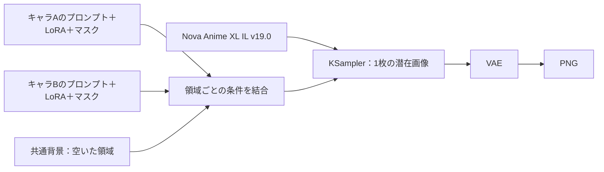

# ワークフローの構成と検証

## キャラごとのLoRA適用

ComfyUI本体の`CreateHookLora`でキャラごとに独立したHookGroupを作り、`PairConditioningSetProperties`で専用のポジティブ・ネガティブ条件とマスクに結び付けています。全キャラは同じ潜在画像を共有し、1個のKSamplerで同時生成します。



- LoRAを全体モデルへ順番に適用する`LoraLoader`は使いません。
- 各HookはCFGの正負両方に適用します。別キャラの負条件にも同じHookを共有する構成にはしません。
- `PairConditioningSetDefaultCombine`でマスクの空き領域を背景条件で埋めます。
- 今回の4本はUNetのみ学習したLoRAのため、`strength_clip=0`。色や衣装のタグはCLIPへ通常通り渡します。
- マスクの境界はFeatherMaskでぼかします。重なった領域では条件が混ざります。
- エンジンは[`comfy.lock.json`](../comfy.lock.json)のcommitで固定。配布JSONの推論ノードはすべてComfyUI本体のものです。独自拡張はStudioの画面・カタログ・JSON組み立てのHTTPルートだけです。

この構成は[ComfyUI公式のMasked LoRA説明](https://blog.comfy.org/p/masking-and-scheduling-lora-and-model-weights)と、[固定したnodes_hooks.py](https://github.com/Comfy-Org/ComfyUI/blob/02d39c8cd7828566f48ccf783c1c75b8336044f5/comfy_extras/nodes_hooks.py)に基づきます。

## キャラを追加・重みを差し替える

`config/models.json`の`characters`へ次の情報を追加します。

```json
{
  "id": "my_character",
  "label": "画面に表示する名前",
  "filename": "my_character.safetensors",
  "sha256": "実ファイルのSHA-256を64文字で指定",
  "trigger": "学習時のトリガー",
  "prompt": "hair color, eye color, clothing, pose"
}
```

重みを`/workspace/models/loras/`へ配置してStudioを再起動します。カタログを増やしても同時に選べる人数は4人までです。再学習したLoRAは同名でもハッシュが変わるため、実ファイルを確認したうえでカタログのSHA-256も更新します。自動で照合を飛ばす仕組みはありません。

Hugging Faceのprivateモデルなどから取得する場合は、Pod上に次のJSONを保存します。

```json
[
  {
    "filename": "my_character.safetensors",
    "url": "https://huggingface.co/OWNER/REPO/resolve/REVISION/my_character.safetensors",
    "sha256": "実ファイルのSHA-256を64文字で指定"
  }
]
```

```bash
ILLUSTRIOUS_LORA_MANIFEST=/workspace/my-loras.json bash /workspace/illustrious-generation/scripts/start.sh
```

`HF_TOKEN`はHugging Face宛、`CIVITAI_TOKEN`はCivitai宛だけに認証ヘッダーとして使用します。URLへトークンを入れないでください。manifestは取得するファイルを指定するものです。画面で新しいキャラを選ぶには、上のカタログ登録も必要です。

## 再現と検証

生成パラメータは`scenes/*.json`、GUI/APIワークフロー生成は`illustrious/workflow.py`です。

```bash
python -m unittest discover -s tests -v
python scripts/export_workflows.py
node --check web/studio.js
bash -n scripts/start.sh
```

ComfyUIとrequirementsを入れたPython環境で、固定commitの実装に対して確認できます。

```bash
python scripts/check_runtime.py --comfy-dir /path/to/ComfyUI --cpu
COMFYUI_PATH=/path/to/ComfyUI python scripts/check_comfy_integration.py
```

確認する内容：

- ダウンロードの再開・サーバーがRangeを無視する場合・認証失敗・破損・既存ファイルの保護。
- パック対象の名前とハッシュ照合、元ファイルと既存パックの保護。
- 1〜4人のAPIグラフを実際のComfyUI `validate_prompt`で検証。
- 実際のComfyUIサンプラーに小さなテストモデルを渡し、左・右・背景の条件が対応する領域に集約されることをCFG両側で確認。
- 画面のキャラ切り替え、プロンプト編集、枠の移動・サイズ変更、ワークフロー書き出し。

CPUのテスト用モデルは動作確認用であり、学習済みLoRAや品質サンプルではありません。**4本の完成LoRAを使ったGPU画像生成・人数維持・着替え・髪色/目色の変更品質は、まだ実画像で評価していません。** RuntimeのGPUチェックも、モデルを使った生成成功とは別です。

実画像の初回確認はSeedを固定した2人・1344×896から始め、左右のキャラ、LoRA強度、髪色、衣装を一項目ずつ変更して比較してください。問題がないことを確認してから3〜4人へ増やします。

## 起動環境を修正するとき

学習用環境を直接pip更新しないでください。専用venvにインストールし、既存のtorch / torchvision / torchaudio / numpy / triton / xformersをconstraintsで保持します。インストール完了後は実際のCLIP・ComfyUIノード・GPU計算を確認します。失敗を無視してモデル取得やサーバー起動へ進めません。

ComfyUIのcommitを変更するときはlock、Docker、GUI/API exports、実装との統合テストを合わせて見直します。学習時に必要だったOpenCVやvoluptuous等の修正を、用途の違う環境へ機械的に追加しないでください。
